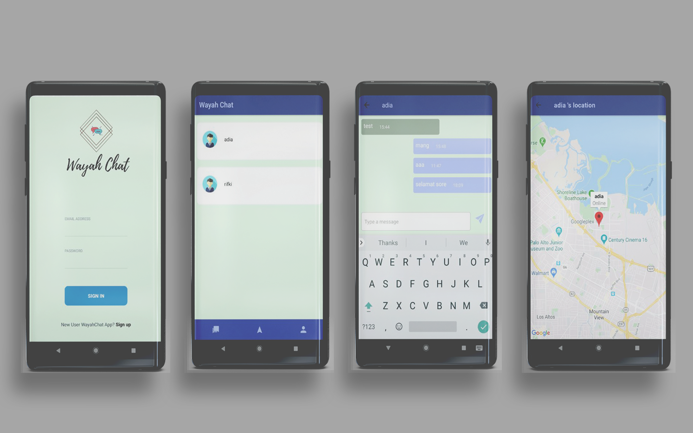

[![React Native][react_native-badge]][react_native-url]
[![Android Platform][android_platform-badge]][android_platform-url]
[![Android Studio][android_studio-badge]][android_studio-url]

# React Native Firebase Chat
<p align="center">
  
</p>


## Introducing
WayahChat is an android real-time chat application with a minimalist design and
 easy to use for users. You can also track the user's location
easily. Created using React Native, google maps API and Firebase databases.

In this project We have used following Firebase serivces.
* **Firebase Authentication** : For authentication user by email
* **Firebase RealTime Database** : That's we for handle realtime chat
* **Firebase Storage** : That's we use for store user profile image


## Requirements

### Mandatory
- [Android Studio](https://developer.android.com/studio/index.html).
- [Node](https://nodejs.org), [Watchman](https://facebook.github.io/watchman/) and [React Native](https://facebook.github.io/react-native/).

### Optional
- [VS Code](https://code.visualstudio.com/)
- [Prettier](https://marketplace.visualstudio.com/items?itemName=esbenp.prettier-vscode)

## Enviroment Settings

### Mandatory
- Install [Android Studio](https://developer.android.com/studio/index.html) and create an emulator.
- Install [Node](https://nodejs.org), [Watchman](https://facebook.github.io/watchman/) and [React Native](https://facebook.github.io/react-native/).


## Firebase Steup
- For Firebase setup you need follow this [instructions](https://firebase.google.com/docs/android/setup)

## Steps to Run
### 1. Clone project and install the dependencies
```
git clone git@github.com:rifkiandriyanto/wayahChat.git && cd wayahChat && npm install
```

### 2. Setup firebase in Android
- Download `google-services.json` from Firebase Project and copy it to `react-native-firebase-chat/android/app`

(For download `google-services.json` use [this](https://support.google.com/firebase/answer/7015592))

### 3. Setup google maps API in Android
- Create API google maps [instruction](https://developers.google.com/maps/documentation/javascript/get-api-key?hl=id)
edit android manifest json copy your API key

### 4. Make sure you have started an emulator and run the app on Android
```
npx react-native run-android
```

## Credits

- [Rifki Andriyanto](https://github.com/rifkiandriyanto)

## License

MIT License. Please see the [license file](LICENSE.md) for more information.


[react_native-badge]: https://img.shields.io/badge/React%20Native-0.57.7-blue.svg?style=flat
[react_native-url]: https://facebook.github.io/react-native/
[android_platform-badge]: https://img.shields.io/badge/Android-4.1+-green.svg
[android_platform-url]: https://developer.android.com/index.html
[android_studio-badge]: https://img.shields.io/badge/Android%20Studio-3.2.1+-green.svg
[android_studio-url]: https://developer.android.com/studio/install
[codebeat-badge]: https://codebeat.co/badges/f22bd54a-d944-440d-aa4d-3a99f79b41d3